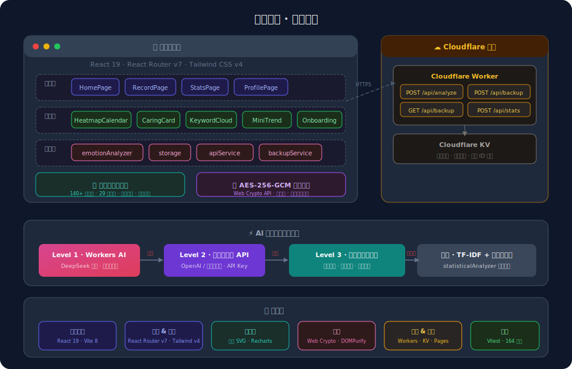
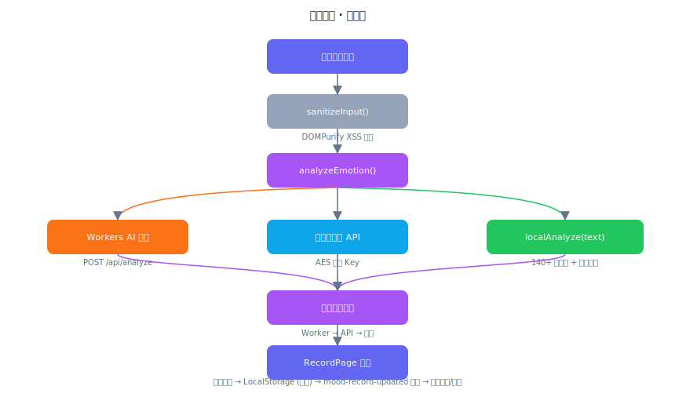
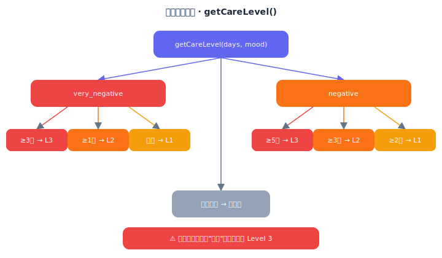
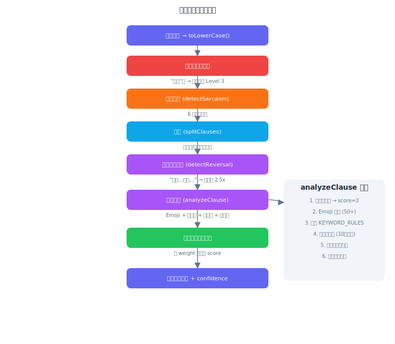
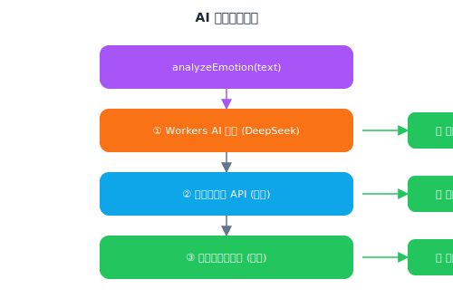
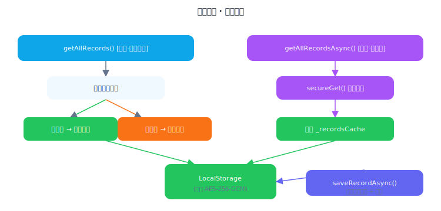
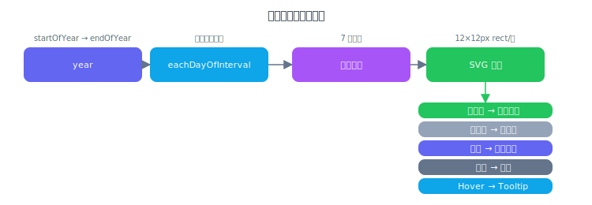
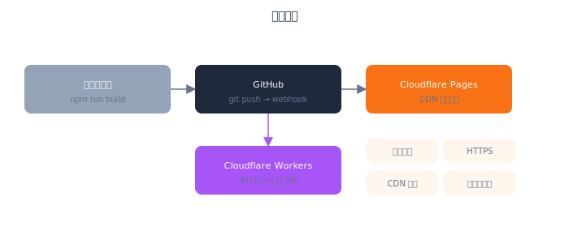

# 技术架构文档

> **当前版本**: v1.9.2 | **更新日期**: 2026-03-27

## 1. 系统概述

情绪日历（Mood Calendar）是一款面向大学生群体的情绪追踪与心理健康可视化 Web 应用。用户每天用一句话记录心情，系统自动分析情绪类型并生成热力图日历，帮助用户建立情绪觉察习惯。

### 1.1 设计理念

- **低门槛**：一句话记录，不需要长篇大论
- **隐私优先**：纯前端核心数据 + 可选匿名统计，用户掌控一切
- **智能分析**：Workers AI 代理 + 本地关键词 + Emoji + 分句加权 + 可选云端 AI，三级降级策略
- **可视化洞察**：热力图 + 统计图表 + 群体情绪对比，发现情绪规律

---

## 2. 技术选型

| 技术 | 版本 | 选型理由 |
|------|------|----------|
| React | 19 | 最新版本，支持 Server Components、并发特性 |
| Vite | 8 | 极速 HMR，原生 ES Module，构建速度快 |
| React Router | v7 | 声明式路由，支持数据加载 |
| Tailwind CSS | v4 | 原子化 CSS，零运行时，体积小 |
| Vitest | 4 | 基于 Vite 的测试框架，与构建工具深度集成 |
| Cloudflare Workers | - | 边缘计算后端，低延迟匿名统计 API |
| Cloudflare KV | - | 键值存储，按月聚合群体情绪数据 |
| Lucide React | 0.577 | 轻量级图标库，Tree-shakable |
| Recharts | 3.8 | 基于 React 的声明式图表库，用于饼图/面积图/柱状图 |
| DOMPurify | 3.3 | XSS 输入净化，防御注入攻击 |

### 2.1 为什么选择"前端为主 + 轻量后端"架构

| 考量 | 方案 | 理由 |
|------|------|------|
| 隐私 | 前端存储核心数据 | 情绪数据敏感，仅匿名统计上云 |
| 成本 | Workers 免费额度 | Cloudflare Workers 每天 10 万次免费请求 |
| 离线 | PWA | Service Worker 缓存，核心功能离线可用 |
| 复杂度 | 适度 | 后端仅做统计聚合，无认证无数据库 |
| 竞赛展示 | 前后端协作 | 展示全栈开发能力，比纯前端更有层次 |

---

## 3. 系统架构

### 3.1 整体分层



### 3.2 数据流



---

## 4. 渐进式关怀系统

### 4.0 关怀等级算法



| 等级 | 触发条件 | 内容 | 热线 |
|------|----------|------|------|
| Level 1 | 1-2 天低落 | 温柔鼓励 + 放松建议 | ❌ |
| Level 2 | 3-4 天低落 | 深度关怀 + 写日记建议 | ✅ 普通样式 |
| Level 3 | 5+ 天低落 | 紧急提示 + 专业帮助建议 | ✅ 高亮样式 |

危机关键词（如"想死"）直接触发 Level 3，不等待连续天数。

### 4.1 关键词云 (KeywordCloud)

从用户记录的 `keywords` 字段和文本中提取高频词，按频率渲染为不同大小的标签云：
- 中文分词：2-6 字词组 + bigram 提取
- 停用词过滤（的、了、是、今天、感觉等）
- 按关联情绪着色（五级情绪对应五色）
- 最少出现 2 次才显示，取前 20 个

### 4.2 迷你趋势图 (MiniTrend)

首页展示近 7 天情绪趋势的迷你折线图，快速感知近期情绪走向。

---

## 5. 核心模块详解

### 4.1 情绪分析引擎 (`emotionAnalyzer.js`)

#### 关键词匹配算法（分句加权 + Emoji + 反转检测）



#### 否定词列表（29 个）

| 类型 | 否定词 |
|------|--------|
| 单字 | 不、没、别 |
| 双字 | 不太、没有、不是、不会、从不、绝不、毫不、毫无、并非、不再、无法、不算、远非 |
| 三字 | 再也不、不怎么、没那么、算不上、谈不上、说不上、不至于、不那么、远没有、算不得、称不上 |
| 四字 | 不太那么、并非真的 |

**检测窗口**：关键词前 10 字符（从 6 扩大到 10，覆盖复合否定词）

#### 相对化表达

| 表达 | 效果 |
|------|------|
| 没那么 | 极端情绪强度回调（如"没那么难过"→ negative 而非 very_negative） |
| 不至于 | 同上 |
| 还算 | 同上 |
| 勉强 | 同上 |

#### Emoji 情绪映射（50+ emoji）

| 情绪级别 | Emoji 示例 |
|---------|-----------|
| very_positive (5) | 😀 😄 🥰 🤩 😍 🥳 🎉 ❤️ ✨ 🌟 |
| positive (4) | 🙂 😎 💪 ⭐ 🤭 😌 |
| neutral (3) | 😐 🤔 🤷 😴 |
| negative (2) | 😟 😔 😣 😢 🥺 😰 😫 |
| very_negative (1) | 😭 😡 🤬 😱 💀 🤯 |

Emoji 作为额外分析信号（weight=1.5），与关键词分析取最优结果。

#### 反转模式检测（"虽然...但是..."）

| 模式 | 效果 |
|------|------|
| 虽然...但是/但 | 后半句权重 2.5x，前半句 0.5x |
| 尽管...但是/但 | 同上 |
| 虽说...但是/但 | 同上 |
| 虽然/尽管...不过 | 同上 |

示例：`"虽然今天很累，但是完成了任务很开心"` → 取"完成任务开心"的正面情绪

#### 情绪五级分类

| 级别 | Key | 标签 | Emoji | 颜色 | 关键词示例 |
|------|-----|------|-------|------|-----------|
| 1 | very_negative | 非常低落 | 😢 | #ef4444 | 绝望、崩溃、不想活 |
| 2 | negative | 有点难过 | 😟 | #f97316 | 难过、沮丧、焦虑 |
| 3 | neutral | 一般般 | 😐 | #eab308 | 一般、还行、普通 |
| 4 | positive | 心情不错 | 😊 | #22c55e | 开心、顺利、感恩 |
| 5 | very_positive | 超级开心 | 🥰 | #6366f1 | 兴奋、幸福、完美 |

#### AI 降级策略



### 4.2 存储服务 (`storage.js`)

#### 缓存架构



**关键设计**：页面初始化时使用 `getAllRecords()` 同步读取避免首屏空白闪烁，随后 `useEffect` 中立即调用 `getAllRecordsAsync()` 异步加载真实数据（兼容加密模式）。数据写入统一使用 `saveRecordAsync()`，事件监听也走异步路径。`saveRecordAsync()` 写入时同步更新 `_recordsCache`，确保缓存一致性。

#### 数据结构

```javascript
{
  id: string,           // crypto.randomUUID() 生成的 UUID
  date: string,         // YYYY-MM-DD
  text: string,         // 用户输入文本
  mood: string,         // 情绪类型 key
  intensity: number,    // 1-5 强度
  moodLabel: string,    // 情绪标签
  suggestion: string,   // 建议文本
  keywords: string[],   // 匹配到的关键词
  analysis: string,     // AI 分析文本
  confidence: number,   // 置信度 0-1
  method: string,       // 'ai' | 'keyword' | 'manual' | 'imported'
  createdAt: string,    // ISO 时间戳
  updatedAt: string     // ISO 时间戳
}
```

#### LocalStorage Key

| Key | 用途 |
|-----|------|
| `mood_calendar_records` | 情绪记录数组（支持 AES-256-GCM 加密） |
| `mood_calendar_reminder` | 提醒设置 |
| `mood_calendar_theme` | 主题偏好 |
| `mood_calendar_onboarded` | 引导完成标记 |
| `ai_api_key` | 用户配置的 AI Key（旧明文，已废弃） |
| `ai_api_url` | 用户配置的 AI URL（旧明文，已废弃） |
| `ai_model` | 用户配置的模型名（旧明文，已废弃） |
| `mood_enc_ai_api_key` | 用户 AI Key（AES-256-GCM 加密存储） |
| `mood_enc_ai_api_url` | 用户 AI URL（AES-256-GCM 加密存储） |
| `mood_enc_ai_model` | 用户模型名（AES-256-GCM 加密存储） |
| `mood_calendar_api_base` | 后端 API 地址 |
| `mood_calendar_anonymous_submit` | 匿名统计开关 |
| `mood_calendar_enc_enabled` | 加密存储开关 |
| `mood_calendar_enc_v1` | AES-256-GCM 加密密钥 |

### 4.3 情绪热力图 (`HeatmapCalendar.jsx`)

#### 渲染逻辑



#### 移动端优化

- 触摸区域扩大到 44×44px（WCAG 标准最低触摸热区）
- `touchStart/touchEnd` 事件支持移动端即时高亮反馈
- `WebkitTapHighlightColor: 'transparent'` 消除点击延迟
- 水平滚动容器 (`overflow-x-auto`)
- `touchAction: 'pan-y'` 防止水平滑动冲突

---

## 6. 关键设计决策

### 5.1 为什么不引入状态管理库

当前使用 `localStorage` + 自定义事件 (`mood-record-updated`) + `window.storage` 事件实现跨组件通信。状态简单（几条记录），不需要 Redux/Zustand 等方案。

### 5.2 为什么自研热力图而非使用第三方库

- GitHub 贡献图风格的日历热力图没有成熟 React 组件
- 自研 SVG 可以精确控制颜色、交互、无障碍属性
- 代码量可控（~200 行），且与业务逻辑解耦

### 5.3 为什么用 CSS 变量而非 Tailwind 暗色模式

Tailwind 的 `dark:` 前缀方案需要大量重复类名。CSS 变量 + `data-theme` 属性方案：
- 只需定义两套变量值
- 组件代码不需要 `dark:xxx` 后缀
- 运行时切换主题更平滑

---

## 7. 测试策略

### 6.1 测试覆盖范围

| 模块 | 测试数 | 覆盖内容 |
|------|--------|----------|
| moodUtils | 12 | 类型定义、颜色映射、文本工具函数 |
| storage | 32 | CRUD、统计计算、连续天数、导入导出、createdAt 保留 |
| emotionAnalyzer | 26 | 关键词分析、否定词(远非/算不得)、混合情绪(虽然...但是...)、emoji、降级策略 |
| emotionAnalyzer.edge | 12 | 边界用例、混合情绪、英文输入 |
| apiService | 12 | API 调用、匿名开关、错误降级 |
| reminder | 7 | 提醒设置、定时检查、通知 |
| HomePage | 7 | 页面渲染、今日卡片、视图切换、最近记录 |
| RecordPage | 12 | 输入框、手动选择、字符计数、已有记录、XSS 过滤 |
| demoData | 10 | 数据生成合理性、周末情绪倾向、字段完整性 |
| **总计** | **130+** | |

### 6.2 未覆盖范围及原因

- **HeatmapCalendar / MonthCalendar / StatsPage**：SVG 和 Recharts 图表渲染测试成本高，核心逻辑已在 service 层覆盖
- **PWA/Service Worker**：需要真实浏览器环境
- **AI API 调用**：依赖外部服务，不适合单元测试

---

## 8. 部署架构



### 构建产物分析（v1.9.1，含 manualChunks 代码分割）

| 文件 | 大小 | gzip | 说明 |
|------|------|------|------|
| index.html | 3.72 KB | 1.41 KB | 入口 HTML（含 SEO/OG/JSON-LD） |
| index.css | 46.98 KB | 8.91 KB | Tailwind CSS |
| index.js (核心) | 193.33 KB | 62.37 KB | React 核心 + 首页路由 |
| vendor-charts.js | 388.17 KB | 112.18 KB | Recharts（懒加载 chunk） |
| vendor-router.js | 41.00 KB | 14.67 KB | React Router（懒加载 chunk） |
| vendor-date.js | 29.29 KB | 8.51 KB | date-fns（懒加载 chunk） |
| vendor-sanitize.js | 21.03 KB | 8.46 KB | DOMPurify（懒加载 chunk） |
| HomePage.js | 20.24 KB | 7.14 KB | 首页（懒加载） |
| RecordPage.js | 21.15 KB | 9.04 KB | 记录页（懒加载） |
| StatsPage.js | 27.96 KB | 7.64 KB | 统计页（懒加载） |
| ProfilePage.js | 20.24 KB | 5.96 KB | 设置页（懒加载） |

**manualChunks 策略**：将 recharts（含 d3）、react-router、date-fns、dompurify 拆为独立 vendor chunk，首次访问首页时只加载核心 bundle + HomePage，进入统计页时按需加载 charts/router/date chunk。

