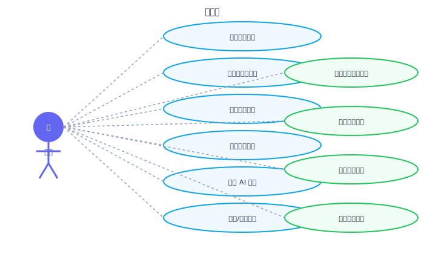

# 需求分析

> **当前版本**: v1.9.2 | **更新日期**: 2026-03-27

## 1. 项目背景

### 1.1 社会背景

大学生心理健康问题日益突出。据《中国国民心理健康发展报告（2021-2022）》：
- 约 **24.6%** 的大学生存在不同程度的心理健康问题
- 抑郁风险检出率为 **21.48%**
- 焦虑风险检出率为 **45.28%**
- 仅 **30%** 的学生在遇到心理问题时会寻求专业帮助

核心痛点：
1. **自我觉察不足** — 多数学生缺乏持续追踪自身情绪变化的工具
2. **求助门槛高** — 传统心理咨询需要预约、排队，学生羞于开口
3. **工具缺失** — 现有心理类 App 偏向专业用户，普通学生难以坚持使用

### 1.2 项目定位

**情绪日历**是一款面向大学生的轻量级情绪追踪工具，通过「每日一句话」的极简记录方式，结合 AI 自动分析，帮助用户：

- 建立情绪自我觉察习惯
- 可视化情绪变化趋势
- 及时发现持续低落状态并获取帮助

## 2. 目标用户

| 特征 | 描述 |
|------|------|
| 年龄 | 18-24 岁 |
| 身份 | 在校大学生（本科/研究生） |
| 设备 | 以手机为主，兼顾电脑 |
| 使用场景 | 睡前、课间、心情波动时 |
| 核心需求 | 简单记录、自我了解、获取建议 |
| 使用频率 | 每日 1 次 |

### 用户画像

**小李（典型用户）**
- 大三学生，学业压力大
- 经常感到焦虑但说不清原因
- 不愿去心理咨询中心（觉得"没那么严重"）
- 希望有一个简单的方式追踪自己的情绪变化

**小王（积极用户）**
- 大一新生，适应期情绪波动
- 对自我成长感兴趣
- 喜欢用 App 记录生活
- 会定期回顾自己的情绪变化

## 3. 功能需求

### 3.1 用例图

### 3.2 功能列表

| 编号 | 功能 | 优先级 | 描述 |
|------|------|--------|------|
| F01 | 每日情绪记录 | P0 | 用户输入一句话描述今日感受，系统记录 |
| F02 | AI 情绪分析 | P0 | 自动分析文本情绪类型和强度 |
| F03 | 情绪热力图 | P0 | 以日历形式展示全年情绪分布 |
| F04 | 情绪趋势图 | P0 | 折线图展示情绪强度变化 |
| F05 | 情绪分布图 | P1 | 饼图展示各类情绪占比 |
| F06 | 星期分布图 | P1 | 柱状图展示各星期平均情绪 |
| F07 | 低落预警 | P0 | 连续低落检测 + 高危关键词预警 |
| F08 | 个性化建议 | P1 | 根据情绪状态给出改善建议 |
| F09 | 历史回顾 | P1 | 搜索、筛选、按月分组浏览 |
| F10 | 数据导入/导出 | P1 | JSON 格式数据迁移 |
| F11 | 匿名群体统计 | P1 | 可选匿名情绪数据贡献 + 群体可视化 |
| F12 | PWA 支持 | P1 | 离线可用 + 安装到桌面 |
| F13 | 本地数据加密 | P1 | AES-256-GCM 加密存储 |
| F14 | 每日提醒 | P2 | 可配置时间的浏览器通知 |
| F15 | 年度报告 | P1 | 年度封面、核心数据、情绪图谱、年度寄语 |

### 3.3 非功能需求

| 类别 | 要求 |
|------|------|
| 性能 | 首屏加载 < 2s，情绪分析响应 < 1s（本地） |
| 兼容性 | Chrome/Firefox/Safari/Edge 最新版本 + 移动端浏览器 |
| 可用性 | 支持 PWA 安装，离线可用（本地模式） |
| 安全性 | AES-256-GCM 加密存储、DOMPurify XSS 防护、Worker 限流、输入校验 |
| 隐私 | 本地优先存储，不收集个人信息，支持数据完全清除 |
| 无障碍 | 语义化 HTML，键盘可操作，颜色对比度 ≥ 4.5:1 |

## 4. 竞品分析

| 维度 | Daylio | 心情温度计 | Moodpath | **情绪日历 (本项目)** |
|------|--------|-----------|----------|---------------------|
| 平台 | iOS/Android | 微信小程序 | iOS/Android | Web (跨平台) |
| 记录方式 | 图标选择 | 滑动温度计 | 问卷 | 自然语言输入 |
| AI 分析 | ❌ | ❌ | ✅ (英文) | ✅ (中文) |
| 可视化 | 基础图表 | 简单折线图 | 周报 | 热力图 + 多维统计 |
| 隐私 | 本地+云 | 云端 | 云端 | 本地优先 |
| 价格 | 免费+内购 | 免费 | 免费+订阅 | 完全免费 |
| 中文支持 | 一般 | ✅ | ❌ | ✅ 原生中文 |
| 心理援助 | ❌ | ❌ | ✅ | ✅ |

### 差异化优势

1. **中文自然语言输入** — 无需选择图标，用一句话描述感受更自然
2. **情绪热力图** — 首创将 GitHub 贡献图模式应用于心理健康领域
3. **双轨分析策略** — 本地关键词 + 云端 AI，离线在线都能用
4. **隐私优先架构** — 所有数据存储在用户设备，不依赖服务器
5. **高危预警机制** — 检测自杀相关关键词，主动推荐心理援助热线
