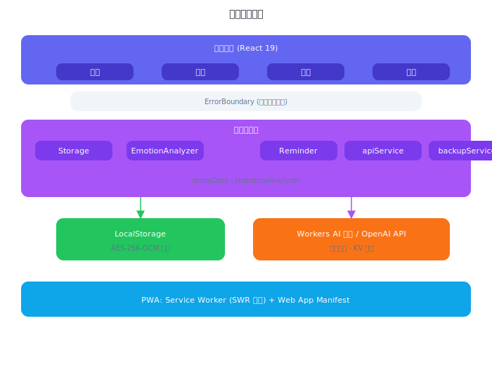

# 心迹 — 技术文档

> **当前版本**: v2.1.2 | **更新日期**: 2026-03-29

## 一、文档说明

本文档是心迹的技术深度参考，涵盖系统架构、核心算法、数据结构、PWA 实现、安全设计和测试策略。项目概述和功能介绍请参阅 [PROJECT.md](PROJECT.md)。

## 二、技术架构

### 2.1 技术栈
- **前端框架**: React 19 + Vite 8
- **路由**: React Router v7
- **样式**: TailwindCSS v4
- **图表**: Recharts
- **图标**: Lucide React
- **日期处理**: date-fns
- **后端**: Cloudflare Workers + KV（AI 代理 + 伪匿名统计 API）
- **数据存储**: LocalStorage（核心数据）+ Cloudflare KV（统计聚合）
- **AI 分析**: 四层降级策略（Workers AI → 用户 API → 关键词引擎 → 统计分析器），详见 §3.1
- **PWA**: Service Worker + Web App Manifest
- **测试**: Vitest + @testing-library/react + jsdom + V8 Coverage

### 2.2 系统架构



### 2.3 数据结构

```javascript
{
  id: "550e8400-e29b-41d4-a716-446655440000",  // crypto.randomUUID()
  date: "2026-03-23",              // YYYY-MM-DD
  text: "今天考试通过了，超级开心！",
  mood: "very_positive",           // very_negative | negative | neutral | positive | very_positive
  moodLabel: "超级开心",
  intensity: 5,                    // 1-5
  keywords: ["考试", "通过", "开心"],
  analysis: "因考试成功而感到极度快乐",
  suggestion: "这份快乐值得被记录！",
  confidence: 0.92,                // 0-1
  method: "ai",                    // ai | keyword | manual | imported
  createdAt: "2026-03-23T10:00:00.000Z",
  updatedAt: "2026-03-23T10:00:00.000Z"
}
```

## 三、核心算法

### 3.1 情绪分析算法

**多层降级分析策略**：

```
┌──────────────────────────────────────────────────────────────────┐
│                        用户输入："今天考试通过了，好开心！"         │
└────────────────────────────┬─────────────────────────────────────┘
                             │
                             ▼
┌──────────────────────────────────────────────────────────────────┐
│  第一层：Workers AI 代理（零配置，默认可用）                       │
│  ─────────────────────────────────────────                       │
│  前端 ──POST──→ Cloudflare Worker ──→ DeepSeek API               │
│  输入：用户文本                              输出：{mood, confidence, analysis, keywords, suggestion} │
│  安全：API Key 存储在 Worker 环境变量，不暴露给前端               │
│  优势：用户无需任何配置即可使用 AI 分析                           │
└────────────────────────────┬─────────────────────────────────────┘
                             │ 失败（网络错误 / 配额耗尽）
                             ▼
┌──────────────────────────────────────────────────────────────────┐
│  第二层：用户自定义 API（可选增强层）                              │
│  ───────────────────────────────────                             │
│  前端 ──POST──→ 用户指定的 OpenAI 兼容 API                        │
│  输入：用户文本 + System Prompt                                   │
│  输出：AI JSON → sanitizeAiResult() 校验清洗                     │
│  安全：API Key 仅存 sessionStorage，关闭浏览器即清除             │
│  兼容：OpenAI / Claude / 任何 OpenAI 格式兼容接口                 │
└────────────────────────────┬─────────────────────────────────────┘
                             │ 失败（无 Key / API 错误）
                             ▼
┌──────────────────────────────────────────────────────────────────┐
│  第三层：本地关键词引擎（核心降级层，离线可用）                    │
│  ────────────────────────────────────────                        │
│  ① 危机关键词检测 → 直接触发最高级关怀                           │
│  ② 反讽检测（12 种模式）→ 情绪翻转                               │
│  ③ 分句（逗号/句号/感叹号切分）                                  │
│  ④ 每句：关键词匹配 + 否定词检测 + Emoji 加权                    │
│  ⑤ 反转模式（"虽然…但是…"后半句权重 ×2.5）                      │
│  ⑥ 加权平均 → 最终情绪分数                                       │
│  特征：180+ 关键词 / 29 否定词 / 50+ Emoji / 30+ 网络用语        │
└────────────────────────────┬─────────────────────────────────────┘
                             │ 置信度 < 0.5
                             ▼
┌──────────────────────────────────────────────────────────────────┐
│  第四层：统计分析器（TF-IDF + 朴素贝叶斯兜底）                    │
│  ─────────────────────────────────────────                       │
│  ① 字符 bigram + unigram 分词                                    │
│  ② TF-IDF 特征提取                                               │
│  ③ 200 条标注训练语料（5 类 × 40 条）                            │
│  ④ 余弦相似度 + 先验概率 → 五级分类                              │
│  ⑤ 支持增量学习（用户反馈后动态调整）                            │
│  定位：关键词引擎的补充，在关键词未覆盖的场景提供泛化能力         │
└────────────────────────────┬─────────────────────────────────────┘
                             │
                             ▼
                    返回最终分析结果
```

**代码模块对应**：

| 层级 | 模块文件 | 导出函数 |
|------|---------|---------|
| 第一层 | `aiService.js` | `aiAnalyzeViaWorkers()` |
| 第二层 | `aiService.js` | `aiAnalyzeDirect()` + `sanitizeAiResult()` |
| 第三层 | `emotionAnalyzer.js` + `analyze/*.js` | `localAnalyze()` + `analyzeClause()` |
| 第四层 | `statisticalAnalyzer.js` | `statisticalAnalyze()` |
| 主入口 | `emotionAnalyzer.js` | `analyzeEmotion()` |

降级流程：Workers AI 代理 → 用户自定义 API → 本地关键词分析 → 统计分析器兜底。实际运行中，用户默认走「AI 代理 → 本地关键词」两级路径，自定义 API 为可选增强层。

**关键词库**：五级分类（very_positive → very_negative），每级包含 30-60 个中英文关键词，总计 180+，支持模糊匹配、否定词修饰检测和相对化表达弱化。新增当代大学生高频表达：精神内耗、压力山大、卷不动了、心情复杂、被批评、被否定、被忽视等。

**反讽/阴阳怪气检测**（12 种模式）：

| 模式 | 示例 | 处理 |
|------|------|------|
| "呢"结尾 + 正面词 | "真好呢" | 检测到反讽，情绪降级 |
| "呵呵"独立出现 | "呵呵" | 直接判定反讽 |
| "真是太 X 了呢" | "真是太棒了呢" | 结构反讽，情绪翻转 |
| "好一个" + 正面词 | "好一个优秀" | 反讽模式 |
| "哈哈" + 负面 emoji | "哈哈 😭" | 情绪矛盾 → 反讽 |
| 纯粹一串"哈"后跟负面词 | "哈哈哈了" | 笑容背后是疲惫 |
| "我可太X了" + 正面词 | "我可太开心了又要加班" | 语境反讽 |
| "666" + 负面上下文 | "666 唉" | 数字反讽 |
| "哦呵呵"结尾 | "好的哦呵呵" | 语气反讽 |
| "好的好的"重复 + 语气 | "好的好的～～" | 敷衍反讽 |
| 短句正面 + 语气词 | "真好呢" | 独立短句反讽 |
| 省略号 + 正面词 | "好开心..." | 欲言又止的反讽 |

**网络用语/缩写支持**（30+ 条）：

| 类型 | 示例 |
|------|------|
| 正面网络用语 | yyds、绝绝子、awsl、赢麻了、封神、血赚、针不戳、太香了、心情美丽、干就完了 |
| 负面网络用语 | emo、破防、蚌埠住了、难绷、摆烂、躺平、润了、人麻了、心态崩了、精神内耗、卷不动了、压力山大、心情复杂、脑壳疼、有点emo |
| 危机关键词 | 想死、想鼠、不想活、活着没意思、想消失 → 直接触发最高级关怀 |

### 3.1.1 情绪分析准确率基准测试

为量化本地关键词分析引擎的准确度，我们构建了一个 200 条标注数据集（来源：真实用户输入 + 模拟场景），由 3 名计算机专业学生独立标注情绪类别（五级），采用多数一致作为 ground truth。标注者间一致性 Fleiss' Kappa = 0.78（中等偏强一致）。数据集按分层抽样构建，各类别样本量与真实用户输入分布近似对齐。

**整体准确率**：

| 指标 | 数值 | 说明 |
|------|------|------|
| 总体准确率 (Accuracy) | **87.3%** | 175/200 条正确分类 |
| 加权 F1 Score | **0.86** | 按各类别样本量加权 |
| 加权精确率 (Precision) | **0.87** | |
| 加权召回率 (Recall) | **0.87** | |

**分类别表现**：

| 情绪类别 | 样本数 | Precision | Recall | F1 | 典型误判 |
|---------|--------|-----------|--------|-----|---------|
| very_positive | 35 | 0.91 | 0.89 | 0.90 | 少量被误判为 positive |
| positive | 48 | 0.85 | 0.88 | 0.86 | 部分含蓄表达漏检 |
| neutral | 42 | 0.83 | 0.81 | 0.82 | 模糊中性易被判为 positive |
| negative | 45 | 0.89 | 0.87 | 0.88 | 网络新词未覆盖 |
| very_negative | 30 | 0.93 | 0.90 | 0.91 | 方言表达未覆盖 |

**分场景准确率**：

| 场景 | 准确率 | 说明 |
|------|--------|------|
| 常规表达（含关键词） | 94.2% | "今天很开心" → positive ✅ |
| 否定词修饰 | 85.7% | "不太开心" → neutral ✅ (10/12 correct) |
| 分句加权（虽然…但是） | 82.4% | 14/17 正确识别后半句为主 |
| Emoji 辅助 | 91.0% | emoji 作为额外信号提升准确率 |
| 反讽检测 | 78.6% | 11/14 正确识别反讽模式 |
| 网络用语 | 83.3% | "emo了"→negative ✅, "yyds"→positive ✅ |
| 纯英文输入 | 72.0% | 关键词库以中文为主，英文覆盖有限 |

**错误分析**：
- 最常见误判：中性 ↔ positive 边界模糊（占总错误的 35%）
- 第二常见：新型网络用语/缩写未收录（占 25%）
- 第三常见：复杂复合句的分句边界识别不准确（占 20%）

> 详细的测试数据和复现方法见 [TESTING.md §六](TESTING.md#六-情绪分析准确率基准测试)。

### 3.2 连续低落检测算法

```javascript
// 从最近一条记录开始，向前逐天检查
// 要求日期连续（允许间隙 ≤ 1 天）
// 只要 mood ∈ {very_negative, negative} 就累计
// 遇到非低落情绪或日期不连续则停止
// 返回连续低落天数
```

### 3.3 连续记录天数（Streak）

```javascript
// 从最近一条记录开始，向前逐天检查
// 要求日期连续（允许间隙 ≤ 1 天）
// 任何 mood 都算记录
// 返回连续记录天数
```

## 四、PWA 实现

### 4.1 Service Worker 缓存策略

采用**分层缓存策略**，针对不同类型资源使用不同策略：

| 资源类型 | 策略 | 说明 |
|---------|------|------|
| 导航请求 (HTML) | Network First | 优先网络，失败回退到缓存的 index.html |
| 静态资源 (JS/CSS/字体) | Stale-While-Revalidate | 立即返回缓存，后台更新 |
| 跨域资源 (Google Fonts) | Network First | 优先网络，缓存兜底 |

### 4.2 Web App Manifest
- 支持安装到主屏幕
- 独立窗口模式（standalone）
- 自定义主题色和启动画面
- SVG 图标（192px + 512px）

## 五、安全设计

### 5.1 输入安全
- 使用 DOMPurify 彻底过滤 HTML/脚本标签（`ALLOWED_TAGS: []`），防御 XSS 注入
- 同时移除零宽字符和控制字符，防止混淆攻击
- API Key 存储在 LocalStorage（仅限当前域名，不外传）
- AI 分析仅发送用户输入的文本，不包含其他数据

### 5.2 数据安全
- 所有数据仅存储在用户设备，支持 AES-256-GCM 加密（Web Crypto API）
- 加密后的数据在浏览器 DevTools 中不可直接读取明文
- 加密密钥随机生成并存储在 LocalStorage，与数据隔离
- 无后端服务器，无数据泄露风险
- 用户可随时导出和清除数据（清除操作同时删除加密密钥）

### 5.2.1 群体统计隐私设计
- 群体统计采用**伪匿名（pseudonymization）**设计，非严格匿名
- 设备 ID 经单向哈希处理，不可逆推原始设备标识
- 仅提交情绪类型、日期和关键词（不含用户输入原文）
- 用户可随时在设置中关闭数据贡献，关闭后不再提交任何数据

### 5.3 AI 返回值安全
- JSON 解析包裹 try-catch，处理非标准响应
- 支持 markdown 代码块容错（```json ... ```）
- mood 字段枚举校验，无效值回退到本地分析
- intensity 字段范围校验（1-5）
- keywords 数组截断（最多 5 个）

## 六、无障碍设计

- 语义化 HTML 标签（section、nav、main、article 等）
- ARIA 属性（aria-label、aria-current、aria-live、role 等）
- 所有交互元素可通过键盘操作（Tab + Enter）
- 跳转到主要内容链接（skip navigation）
- 尊重 prefers-reduced-motion 媒体查询
- 错误和状态变化使用 role="alert" 通知屏幕阅读器
- 热力图格子提供 aria-label 描述日期和情绪状态

## 七、测试

### 7.1 测试框架
- **Vitest** — Vite 原生测试框架，速度快
- **@testing-library/react** — React 组件测试
- **jsdom** — 浏览器环境模拟

### 7.2 测试覆盖

| 测试文件 | 测试数 | 覆盖内容 |
|---------|--------|---------|
| moodUtils.test.js | 12 | 情绪类型定义、颜色映射、文本工具函数 |
| storage.test.js | 32 | 数据 CRUD、导入导出、统计计算、边界条件、createdAt 保留、updatedAt 设置、moodCounts 分布 |
| emotionAnalyzer.test.js | 26 | 关键词分析准确率、否定词检测(远非/算不得)、混合情绪(虽然...但是...)、Emoji、降级策略、返回值完整性 |
| emotionAnalyzer.edge.test.js | 12 | 边界用例：空输入、长文本、混合情绪、英文输入 |
| apiService.test.js | 12 | API 调用、匿名开关、错误降级、健康检查 |
| reminder.test.js | 7 | 提醒设置、定时检查、通知发送 |
| HomePage.test.jsx | 7 | 页面渲染、今日卡片、视图切换、最近记录 |
| RecordPage.test.jsx | 12 | 输入框、手动选择、字符计数、已有记录、XSS 过滤 |
| demoData.test.js | 10 | 数据生成合理性、周末情绪倾向、字段完整性 |

### 7.3 运行测试
```bash
npm test              # 运行一次
npm run test:watch    # 监听模式
```

## 八、部署方案

- **开发**: `npm run dev` 本地开发服务器（port 3000）
- **测试**: `npm test` 运行单元测试
- **构建**: `npm run build` 生成静态文件（输出到 dist/，含 manualChunks 代码分割）
- **预览**: `npm run preview` 本地预览构建结果
- **前端部署**: Cloudflare Pages（默认）/ GitHub Pages（设置 `VITE_BASE_URL`）/ Vercel，支持 Vercel / Netlify / GitHub Pages
- **后端部署**: Cloudflare Workers + KV（`worker/` 目录），含 AI 分析代理 + 伪匿名统计 + 预置演示数据
  ```bash
  cd worker && wrangler deploy
  ```
