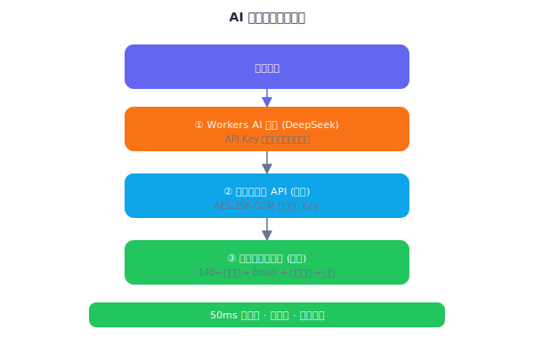

# 情绪日历 — 技术文档

> **当前版本**: v2.0.0 | **更新日期**: 2026-03-28

## 一、项目概述

### 1.1 项目名称
**情绪日历 (Mood Calendar)** — AI 驱动的情绪追踪与可视化应用

### 1.2 核心功能

| 功能 | 说明 | 技术实现 |
|------|------|---------|
| 每日情绪记录 | 自然语言输入 + 日期切换 + **可编辑已有记录** | React 表单 + date-fns 日期导航 |
| AI 情绪分析 | 四级降级：Workers AI → 用户 API → 140+ 关键词引擎 → TF-IDF 统计分析器 | 分句加权 + 反讽检测 + 网络用语 + 否定词 |
| 情绪热力图日历 | GitHub 贡献图风格，年/月双视图，**响应式移动端** | 自研 SVG 组件（动态格子尺寸） |
| 情绪趋势图表 | 饼图 + 面积图 + 柱状图 + 情绪河流图 | Recharts |
| 年度报告 | **卡片翻页式叙事**：封面 → 环形图 → 河流图 → 故事线 → 月度对比 → 关键词 → 寄语 | SVG 环形图 + Recharts stacked area + 时间轴 |
| 3 级渐进式关怀 | 根据连续低落天数 + 情绪强度动态升级 | CaringCard 组件 + 危机关键词检测 |
| 新用户引导 | 4 步交互式 Onboarding | 独立 React 组件 |
| 每日提醒 | 浏览器通知 + 可配置时间 | Notification API |
| PWA 支持 | 离线可用 + 安装到桌面 | Service Worker (SWR 策略) + Manifest |
| 数据导入/导出 | JSON 格式迁移 | FileReader API |
| 匿名群体统计 | 可选匿名情绪数据贡献 + 群体可视化 + 预置演示数据 | Cloudflare Workers + KV |
| 本地数据加密 | AES-256-GCM 加密存储 | Web Crypto API + 内存缓存架构 |
| 云端备份 | 基于设备 ID 的无注册备份/恢复 | backupService + Worker + KV |
| **设计系统** | **卡片光晕边框 + 多色渐变文字 + 情绪发光 + 微交互动画** | **CSS 自定义属性 + keyframe 动画** |

## 二、技术架构

### 2.1 技术栈
- **前端框架**: React 19 + Vite 8
- **路由**: React Router v7
- **样式**: TailwindCSS v4
- **图表**: Recharts
- **图标**: Lucide React
- **日期处理**: date-fns
- **后端**: Cloudflare Workers + KV（AI 代理 + 匿名统计 API）
- **数据存储**: LocalStorage（核心数据）+ Cloudflare KV（统计聚合）
- **AI 分析**: Workers AI 代理（DeepSeek）+ 本地关键词分析（140+ 关键词 + Emoji + 分句加权 + 反讽检测 + 20+ 网络用语）+ OpenAI 兼容 API（可选）
- **PWA**: Service Worker + Web App Manifest
- **测试**: Vitest + @testing-library/react + jsdom + V8 Coverage

### 2.2 系统架构


### 2.3 数据结构

```javascript
{
  id: "550e8400-e29b-41d4-a716-446655440000",  // crypto.randomUUID()
  date: "2026-03-23",              // YYYY-MM-DD
  text: "今天考试通过了，超级开心！",
  mood: "very_positive",           // very_negative | negative | neutral | positive | very_positive
  moodLabel: "超级开心",
  intensity: 5,                    // 1-5
  keywords: ["考试", "通过", "开心"],
  analysis: "因考试成功而感到极度快乐",
  suggestion: "这份快乐值得被记录！",
  confidence: 0.92,                // 0-1
  method: "ai",                    // ai | keyword | manual | imported
  createdAt: "2026-03-23T10:00:00.000Z",
  updatedAt: "2026-03-23T10:00:00.000Z"
}
```

## 三、核心算法

### 3.1 情绪分析算法

**三级降级分析策略**：



**关键词库**：五级分类（very_positive → very_negative），每级包含 25-50 个中英文关键词，总计 140+，支持模糊匹配、否定词修饰检测和相对化表达弱化。

**反讽/阴阳怪气检测**（6 种模式）：

| 模式 | 示例 | 处理 |
|------|------|------|
| "呢"结尾 + 正面词 | "真好呢" | 检测到反讽，情绪降级 |
| "呵呵"独立出现 | "呵呵" | 直接判定反讽 |
| "真是太 X 了呢" | "真是太棒了呢" | 结构反讽，情绪翻转 |
| "好一个" + 正面词 | "好一个优秀" | 反讽模式 |
| "哈哈" + 负面 emoji | "哈哈 😭" | 情绪矛盾 → 反讽 |
| 整体检测 | 多模式组合 | 取最高优先级结果 |

**网络用语/缩写支持**（20+ 条）：

| 类型 | 示例 |
|------|------|
| 正面网络用语 | yyds、绝绝子、awsl、赢麻了、封神、血赚 |
| 负面网络用语 | emo、破防、蚌埠住了、难绷、摆烂、躺平、润了、人麻了、心态崩了 |
| 危机关键词 | 想死、想鼠、不想活 → 直接触发最高级关怀 |

### 3.2 连续低落检测算法

```javascript
// 从最近一条记录开始，向前逐天检查
// 要求日期连续（允许间隙 ≤ 1 天）
// 只要 mood ∈ {very_negative, negative} 就累计
// 遇到非低落情绪或日期不连续则停止
// 返回连续低落天数
```

### 3.3 连续记录天数（Streak）

```javascript
// 从最近一条记录开始，向前逐天检查
// 要求日期连续（允许间隙 ≤ 1 天）
// 任何 mood 都算记录
// 返回连续记录天数
```

## 四、PWA 实现

### 4.1 Service Worker 缓存策略

采用**分层缓存策略**，针对不同类型资源使用不同策略：

| 资源类型 | 策略 | 说明 |
|---------|------|------|
| 导航请求 (HTML) | Network First | 优先网络，失败回退到缓存的 index.html |
| 静态资源 (JS/CSS/字体) | Stale-While-Revalidate | 立即返回缓存，后台更新 |
| 跨域资源 (Google Fonts) | Network First | 优先网络，缓存兜底 |

### 4.2 Web App Manifest
- 支持安装到主屏幕
- 独立窗口模式（standalone）
- 自定义主题色和启动画面
- SVG 图标（192px + 512px）

## 五、安全设计

### 5.1 输入安全
- 使用 DOMPurify 彻底过滤 HTML/脚本标签（`ALLOWED_TAGS: []`），防御 XSS 注入
- 同时移除零宽字符和控制字符，防止混淆攻击
- API Key 存储在 LocalStorage（仅限当前域名，不外传）
- AI 分析仅发送用户输入的文本，不包含其他数据

### 5.2 数据安全
- 所有数据仅存储在用户设备，支持 AES-256-GCM 加密（Web Crypto API）
- 加密后的数据在浏览器 DevTools 中不可直接读取明文
- 加密密钥随机生成并存储在 LocalStorage，与数据隔离
- 无后端服务器，无数据泄露风险
- 用户可随时导出和清除数据（清除操作同时删除加密密钥）

### 5.3 AI 返回值安全
- JSON 解析包裹 try-catch，处理非标准响应
- 支持 markdown 代码块容错（```json ... ```）
- mood 字段枚举校验，无效值回退到本地分析
- intensity 字段范围校验（1-5）
- keywords 数组截断（最多 5 个）

## 六、无障碍设计

- 语义化 HTML 标签（section、nav、main、article 等）
- ARIA 属性（aria-label、aria-current、aria-live、role 等）
- 所有交互元素可通过键盘操作（Tab + Enter）
- 跳转到主要内容链接（skip navigation）
- 尊重 prefers-reduced-motion 媒体查询
- 错误和状态变化使用 role="alert" 通知屏幕阅读器
- 热力图格子提供 aria-label 描述日期和情绪状态

## 七、测试

### 7.1 测试框架
- **Vitest** — Vite 原生测试框架，速度快
- **@testing-library/react** — React 组件测试
- **jsdom** — 浏览器环境模拟

### 7.2 测试覆盖

| 测试文件 | 测试数 | 覆盖内容 |
|---------|--------|---------|
| moodUtils.test.js | 12 | 情绪类型定义、颜色映射、文本工具函数 |
| storage.test.js | 32 | 数据 CRUD、导入导出、统计计算、边界条件、createdAt 保留、updatedAt 设置、moodCounts 分布 |
| emotionAnalyzer.test.js | 26 | 关键词分析准确率、否定词检测(远非/算不得)、混合情绪(虽然...但是...)、Emoji、降级策略、返回值完整性 |
| emotionAnalyzer.edge.test.js | 12 | 边界用例：空输入、长文本、混合情绪、英文输入 |
| apiService.test.js | 12 | API 调用、匿名开关、错误降级、健康检查 |
| reminder.test.js | 7 | 提醒设置、定时检查、通知发送 |
| HomePage.test.jsx | 7 | 页面渲染、今日卡片、视图切换、最近记录 |
| RecordPage.test.jsx | 12 | 输入框、手动选择、字符计数、已有记录、XSS 过滤 |
| demoData.test.js | 10 | 数据生成合理性、周末情绪倾向、字段完整性 |

### 7.3 运行测试
```bash
npm test              # 运行一次
npm run test:watch    # 监听模式
```

## 八、部署方案

- **开发**: `npm run dev` 本地开发服务器（port 3000）
- **测试**: `npm test` 运行单元测试
- **构建**: `npm run build` 生成静态文件（输出到 dist/，含 manualChunks 代码分割）
- **预览**: `npm run preview` 本地预览构建结果
- **前端部署**: Cloudflare Pages（默认）/ GitHub Pages（设置 `VITE_BASE_URL`）/ Vercel，支持 Vercel / Netlify / GitHub Pages
- **后端部署**: Cloudflare Workers + KV（`worker/` 目录），含 AI 分析代理 + 匿名统计 + 预置演示数据
  ```bash
  cd worker && wrangler deploy
  ```
